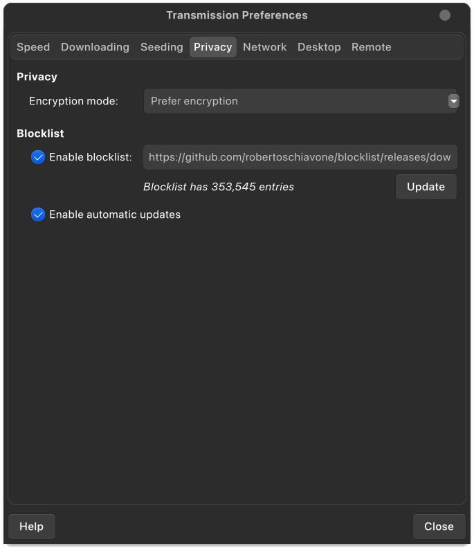

# Torrent Blocklist

This repository contains only one GitHub Action that pulls and merges together lists from [I-Blocklist](https://www.iblocklist.com/). The list excludes IANA reserved addresses, unallocated addresses and Tor IPs, and it's refreshed daily.

The generated file is in [P2P plaintext format](https://en.wikipedia.org/wiki/PeerGuardian#P2P_plaintext_format) and the latest version can always be found [here](https://github.com/robertoschiavone/blocklist/releases/download/latest/blocklist.p2p).

Inspired by the previous work of [@johntyree](https://gist.github.com/johntyree/3331662)

